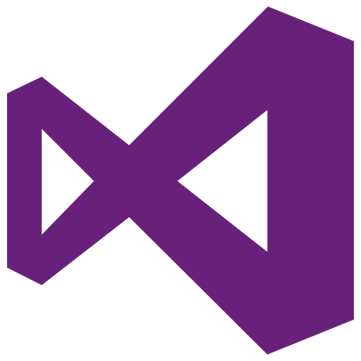
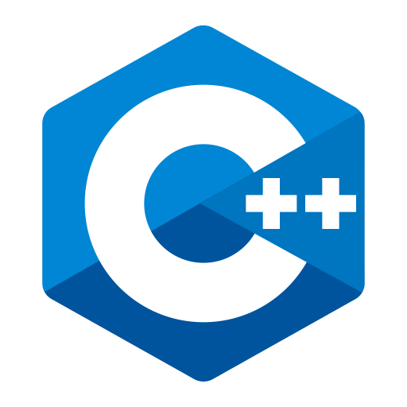
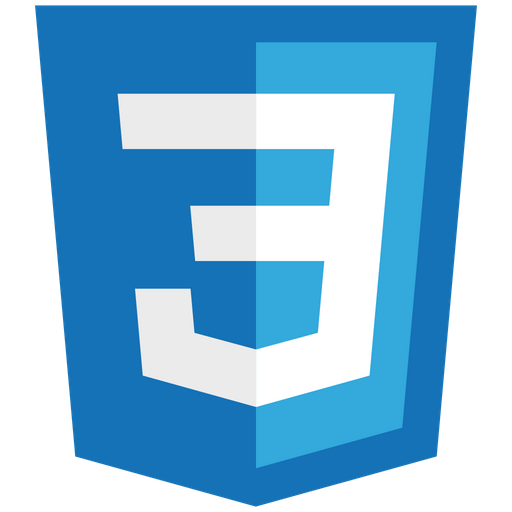
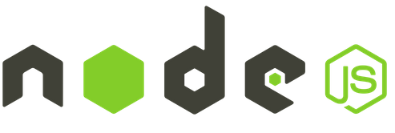
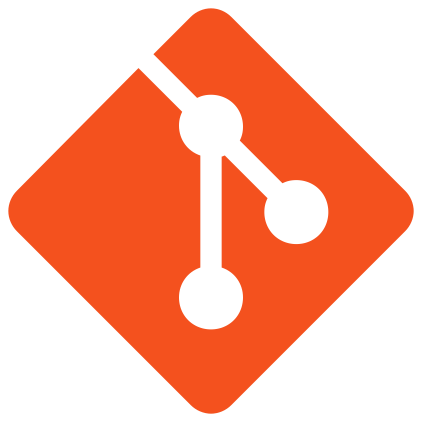
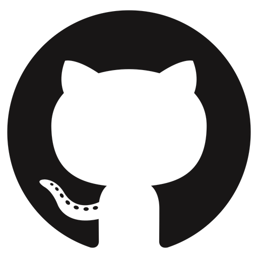

### Hi there, I'm Toby 👋

## I'm a Student!
- 🔭 I’m currently working on a Software Development Project
- 🌱 I’m currently learning Web Development
- 💬 Would love any internship offers

### Connect with me:

[][twitter]
[][linkedin]
[][instagram]

[twitter]: https://twitter.com/TobyDixonSmith1
[instagram]: https://www.instagram.com/toby_ds1/
[linkedin]: https://www.linkedin.com/in/toby-dixon-smith-4734331a3/

 

### Languages and Tools:

 
 

## :zap: Development Stats

<!--START_SECTION:waka-->

**🐱 My Github Data** 

> 🏆 5 Contributions in the Year 2022
 > 
> 📦 13.9 kB Used in Github's Storage 
 > 
> 💼 Opted to Hire
 > 
> 📜 11 Public Repositories 
 > 
> 🔑 6 Private Repositories  
 > 
**I'm a Night 🦉** 

<table>
  <tr><td>🌞 Morning</td><td>0 commits</td><td>░░░░░░░░░░░░░░░░░░░░░░░░░   0.0%</td></tr> 
  <tr><td>🌆 Daytime</td><td>0 commits</td><td>░░░░░░░░░░░░░░░░░░░░░░░░░   0.0%</td></tr> 
  <tr><td>🌃 Evening</td><td>36 commits</td><td>████████████░░░░░░░░░░░░░   48.0%</td></tr> 
  <tr><td>🌙 Night</td><td>39 commits</td><td>█████████████░░░░░░░░░░░░   52.0%</td></tr>
</table>

📅 **I'm Most Productive on Friday** 

<table>
  <tr><td>Monday</td><td>18 commits</td><td>██████░░░░░░░░░░░░░░░░░░░   24.0%</td></tr> 
  <tr><td>Tuesday</td><td>22 commits</td><td>███████░░░░░░░░░░░░░░░░░░   29.33%</td></tr> 
  <tr><td>Wednesday</td><td>0 commits</td><td>░░░░░░░░░░░░░░░░░░░░░░░░░   0.0%</td></tr> 
  <tr><td>Thursday</td><td>1 commits</td><td>░░░░░░░░░░░░░░░░░░░░░░░░░   1.33%</td></tr> 
  <tr><td>Friday</td><td>31 commits</td><td>██████████░░░░░░░░░░░░░░░   41.33%</td></tr> 
  <tr><td>Saturday</td><td>3 commits</td><td>█░░░░░░░░░░░░░░░░░░░░░░░░   4.0%</td></tr> 
  <tr><td>Sunday</td><td>0 commits</td><td>░░░░░░░░░░░░░░░░░░░░░░░░░   0.0%</td></tr>
</table>

📊 **This Week I Spent My Time On** 

<table>
<tr><th colspan="3"> 💬 <i>Programming Languages</i></th></tr> 
No Activity Tracked This Week

<tr><th colspan="3"> 🔥 <i>Editors</i></th></tr> 
No Activity Tracked This Week

<tr><th colspan="3"> 🐱‍💻 <i>Projects</i></th></tr> 
No Activity Tracked This Week

<tr><th colspan="3"> 💻 <i>Operating System</i></th></tr> 
No Activity Tracked This Week
</table>

**I Mostly Code in C++** 

<table>
  <tr><td>C++</td><td>3 repos</td><td>████░░░░░░░░░░░░░░░░░░░░░   17.65%</td></tr> 
  <tr><td>C</td><td>3 repos</td><td>████░░░░░░░░░░░░░░░░░░░░░   17.65%</td></tr> 
  <tr><td>PHP</td><td>2 repos</td><td>███░░░░░░░░░░░░░░░░░░░░░░   11.76%</td></tr> 
  <tr><td>Python</td><td>2 repos</td><td>███░░░░░░░░░░░░░░░░░░░░░░   11.76%</td></tr> 
  <tr><td>HTML</td><td>2 repos</td><td>███░░░░░░░░░░░░░░░░░░░░░░   11.76%</td></tr>
</table>

 Last Updated on 24/05/2022
<!--END_SECTION:waka-->

## :zap: Github Stats

